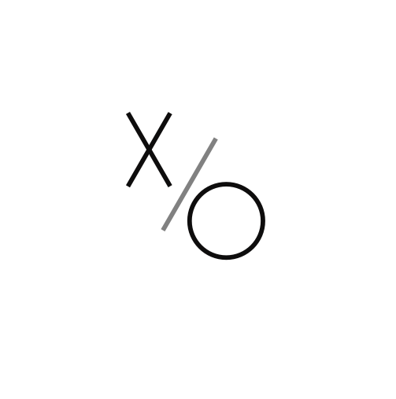

**X/O** — ROS + Brain.js robot, who would certainly outplay you in Tic-Tac-Toe game! Whereas **ROS** would control the manipulartor, **brain.js** would calculate the best strategies. Also you can use this as the API for your reasons

This API is designed to solve tic-tac-toe game on whatever canvas it is asked, fetching current board and sending new board every turn.

## Currently under development

### Tasks

- [x] Prepare a repository
- [ ] Make a neural network to work in local area
- [ ] Make the canvas of the game resizable before start
- [ ] Design API Calls
- [ ] Build a UI
- [ ] Connect the API to **X/O** Robottt
- [ ] Construct a documentation
- [ ] Refacture if needed
